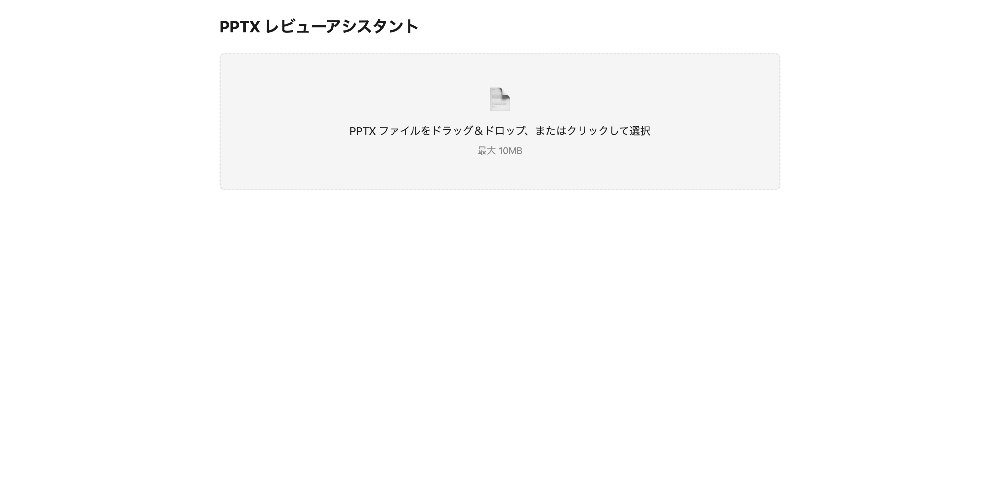
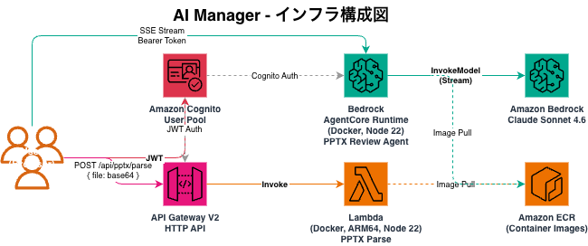

# AI Manager - PPTX レビューアシスタント

PPTX ファイルをアップロードし、AI がプレゼン資料をレビューする Web アプリケーション。



## インフラ構成



| サービス | 用途 |
|---|---|
| Amazon Cognito | ユーザー認証（JWT トークン発行） |
| API Gateway V2 | PPTX 解析 API エンドポイント (`POST /api/pptx/parse`) |
| Lambda (Docker, ARM64, Node 22) | PPTX ファイルのテキスト・構造抽出 |
| Bedrock AgentCore Runtime | AI レビューエージェント（SSE ストリーミング） |
| Amazon Bedrock | Claude Sonnet 4.6 によるレビュー生成 |
| Amazon ECR | Lambda / AgentCore 用 Docker イメージ |

## 技術スタック

- **Frontend**: React 19, Vite, TypeScript, Tailwind CSS 4
- **Backend**: AWS Amplify Gen2, AWS CDK
- **AI**: Vercel AI SDK (`ToolLoopAgent`), `@ai-sdk/amazon-bedrock`
- **解析**: jszip, fast-xml-parser v5

## セットアップ

```bash
npm install
```

### ローカル開発

```bash
npx ampx sandbox

# 別ターミナル
npm run dev
```

## 使い方

1. ログイン（Cognito 認証）
2. PPTX ファイルをドラッグ＆ドロップ（最大 10MB）
3. 「解析する」でスライドのテキスト・構造を抽出
4. 「AI レビューを実行」で 4 観点（構成・明確さ・情報量・表現）のレビューをストリーミング表示

## プロジェクト構成

```
amplify/
  auth/resource.ts              # Cognito 認証設定
  functions/pptx-parse/
    resource.ts                  # Lambda + API Gateway CDK 定義
    handler.ts                   # Lambda ハンドラー
    pptx-parser.ts               # PPTX XML 解析ロジック
    Dockerfile                   # Lambda コンテナ
  agent/
    resource.ts                  # AgentCore Runtime CDK 定義
    app.ts                       # レビューエージェント (ToolLoopAgent)
    Dockerfile                   # AgentCore コンテナ
  backend.ts                     # Amplify バックエンド定義
src/
  App.tsx                        # メイン UI（アップロード・解析・レビュー）
  main.tsx                       # エントリーポイント（Authenticator）
```
