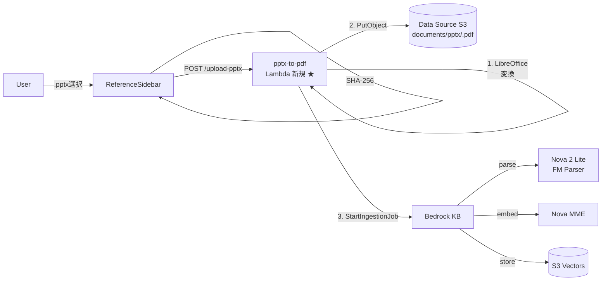

# AI Manager — Step 12

## PPTX を「図表まで検索可能」にする

step-11 のマルチモーダル KB に **PPTX 登録パイプライン** を追加

<div class="pt-12">
  <span class="text-sm opacity-75">2026-04-23 / pptx-slide-to-kb</span>
</div>

---

# 背景: PPTX の情報は「見た目」に詰まっている

組織内ナレッジの多くは PowerPoint に存在：

- 業務フロー図
- システム構成図
- 製品仕様書
- AWS アーキテクチャ図

<div class="mt-6 text-xl text-center opacity-80">
  スライドの <b>矢印・関係性・レイアウト</b> まで<br/>
  検索可能にしたい
</div>

---

# 採用した王道: PPTX → PDF → Foundation Model Parser

```
PPTX  ──[LibreOffice]──>  PDF  ──[FM Parser]──>  構造化テキスト + ベクトル化
```

<div class="mt-6">

**なぜこれが効くのか**：

- 我々の KB には既に **Foundation Model Parser (Nova 2 Lite)** が動いている
- FM Parser は PDF 内の図表・フローチャート・画像を LLM が読み取って構造化テキストに変換
- **追加で必要なのは PPTX→PDF 変換レイヤーだけ**

</div>

<div class="mt-6 text-sm opacity-75">
  既存 KB・埋め込みモデル・パーサーは無変更。サイドバーに PPTX アップロード口を足し、裏に変換 Lambda を 1 本追加するだけ
</div>

---

# アーキテクチャ全体像



<div class="mt-2 text-sm opacity-75 text-center">
  新規は <b>pptx-to-pdf Lambda + POST /upload-pptx</b> のみ
</div>

---

# 6 つの設計決定

| # | 決定 | 理由 |
|---|------|------|
| 1 | PPTX→PDF 変換は **LibreOffice headless** + **Debian slim** Lambda | Debian slim + aws-lambda-ric で LibreOffice を同梱 |
| 2 | クライアント側は **1 リクエスト完結**（`POST /upload-pptx`） | 進捗 UI を 2 フェーズに簡素化 |
| 3 | S3 キーは **`documents/pptx/<pptxHash>.pdf`** | 冪等・重複判定が単純、documents/ 配下で FM Parser の対象に |
| 4 | メタデータは **S3 Object Metadata ヘッダ** | Metadata + URL encode 1 段で日本語名も安全 |
| 5 | `/api/documents/start-ingestion` は残す | 管理運用（手動再取り込み）で有用 |
| 6 | クライアント上限は **4 MB のまま** | 50MB 対応は presigned URL 化で別チェンジ |

---

# 決定 1: Debian slim + aws-lambda-ric

LibreOffice を apt で入れ、Lambda Runtime Interface Client で Lambda として起動

```dockerfile {all|1|3-5|all}
FROM --platform=linux/arm64 public.ecr.aws/docker/library/node:22-slim

RUN apt-get update && apt-get install -y --no-install-recommends \
      libreoffice fonts-noto-cjk fonts-dejavu \
      build-essential cmake python3 autoconf automake \
      libtool libcurl4-openssl-dev unzip ca-certificates \
    && fc-cache -f

COPY package.json ./ && RUN npm install
COPY handler.ts ./ && RUN npx tsc ...

ENTRYPOINT ["/var/task/node_modules/.bin/aws-lambda-ric"]
CMD ["handler.handler"]
```

<div class="mt-4 text-sm opacity-75">
  ✅ <code>apt install libreoffice fonts-noto-cjk</code> で日本語フォント込みの変換環境<br/>
  ✅ <code>aws-lambda-ric</code> が Debian 系ベースでも Lambda として動作させる橋渡し
</div>

---

# 決定 2-3: 1 リクエスト完結 + 冪等キー

```ts
// クライアント側（ReferenceSidebar）
const pptxHash = await computePptxHash(file)            // SHA-256 先頭 12 文字
const { ingestionJobId } = await uploadPptx(file, pptxHash)
// → サーバー側で LibreOffice 変換 → PutObject → StartIngestionJob まで 1 発で完結
```

<div class="mt-4">

### S3 キー命名

```
documents/pptx/a1b2c3d4e5f6.pdf
           │    └── SHA-256 先頭 12 文字
           └── documents/ 配下 (FM Parser 対象)
```

- 同じ内容の PPTX を再アップロードすると **同一キーで上書き** → 冪等
- `documents/` プレフィックスに入るので、既存の FM Parser 設定がそのまま効く

</div>

---

# 決定 4: S3 Object Metadata ヘッダ方式

日本語ファイル名を安全に保存するために、タグではなく Metadata ヘッダを使用

```ts
await s3.send(new PutObjectCommand({
  Bucket: BUCKET_NAME,
  Key: 'documents/pptx/<hash>.pdf',
  Body: pdfBuffer,
  ContentType: 'application/pdf',
  Metadata: {
    'source-type': 'pptx-pdf',
    'original-pptx-name': encodeURIComponent('設計書.pptx'),  // URL encode 1 段で OK
  },
}))
```

<div class="mt-4 text-sm opacity-75">
  読み取りは <code>HeadObject</code> → <code>decodeURIComponent</code> で元の日本語名に復元<br/>
  一覧表示ラベル: 「<code>設計書.pptx (PDF変換済)</code>」
</div>

---

# 既存機能への影響（ほぼ無し）

| 既存処理 | 影響 |
|---|---|
| MD / 画像 / PDF の `/upload` | 無変更 |
| 一覧取得 `/documents` | PPTX PDF 判定のみ追加 |
| 削除 `/documents/{key}` | 無変更 |
| レビュー機能（pptx-parse + Agent） | 完全に無関係 |
| 一覧 UI ラベル | PPTX 由来だけ追加表示 |

<div class="mt-3 text-sm text-green-700">
  <b>Non-BREAKING change</b> — PPTX 変換パイプラインが純増
</div>

---

# ユーザー体験の変化

| 操作 | 従来 | 修正後 |
|---|---|---|
| `.md` を追加 | 即アップロード → インジェスト | **変化なし** |
| `.png` を追加 | 即アップロード → インジェスト | **変化なし** |
| **`.pptx` を追加** | 未対応 | **変換中 → 取り込み開始中** 1 クリック |
| レビュー実行 | PPTX パース + AI レビュー | **変化なし** |

<div class="mt-6 text-center">
  サイドバーに <b>.pptx を放り込むだけ</b> で、<br/>
  数十秒後には図表の中身まで検索可能に
</div>

---

# Retrieve 側の効果: AWS 構成図検索

例: AgentCore 構成図の PPTX を登録したあと、
Agent が「AgentCore を使う構成について教えて」と聞くと...

FM Parser が抽出したテキスト例：

```
このスライドは AgentCore Runtime ベースの構成を示す：
- API Gateway がユーザーリクエストを受け、JWT Authorizer で認証
- Bedrock AgentCore Runtime が Agent コンテナを実行
- Agent から Bedrock Knowledge Base を Retrieve
- ベクトルストアは S3 Vectors、埋め込みは Nova MME
- マルチモーダル保存は S3 (multimodal storage bucket)
```

<div class="mt-4 text-sm opacity-75">
  アイコン・矢印・レイアウトの関係性まで <b>構造化テキストとして保存</b> される
</div>

---

# トレードオフ

| 項目 | 内容 |
|---|---|
| Docker image size | ~1 GB（LibreOffice + ビルドツール）、デプロイ時間 5-10 分増 |
| Cold start | 3〜5 秒（LibreOffice 初期化含む） |
| 変換時間 | 5〜15 秒 / PPTX（スライド数・画像量に依存） |
| Lambda 設定 | 3008 MB メモリ、timeout 5 分、ephemeral 2 GB |
| FM Parser コスト | Nova 2 Lite 単価で PDF 内容量 x 呼び出し回数（Sonnet 比で桁違いに安い） |
| **非対応** | 4 MB 超 PPTX、破損 PPTX、特殊 SmartArt |

<div class="mt-4 text-sm opacity-75">
  どれも事前把握済み、MVP のスコープで許容範囲
</div>

---

# 残課題と今後

🔲 **Presigned URL 化**: 4 MB → 50 MB まで拡張（別チェンジ）
🔲 **変換後 PDF 50 MB 超対策**: LibreOffice の PDF 圧縮オプション追加
🔲 **マルチステージ Docker**: ビルドツールを runtime イメージから削って軽量化
🔲 **運用手順書**: docs/ に「PPTX 登録の仕方」ガイド追記
🔲 **S3 Vectors の上限確認**: 大量 PPTX 登録時のメタデータ上限
🔲 **ジョブ失敗時の自動リトライ**: 現状は手動再アップロード

---

# OpenSpec 成果物

```
openspec/changes/archive/2026-04-23-pptx-slide-to-kb/
├── proposal.md    (Why / What Changes / Capabilities / Impact)
├── design.md      (6 decisions + risks + migration plan)
├── specs/
│   └── reference-data-management/spec.md   (delta)
└── tasks.md       (40 tasks)
```

main specs への反映（`reference-data-management`）：

- **MODIFIED**: 参照ファイルのアップロード（`.pptx` 追加）
- **ADDED**: PPTX→PDF 変換パイプライン、メタデータ保存、一覧表示、UI 進捗、IAM 権限（計 6 件）

---
layout: center
class: text-center
---

# まとめ

<div class="text-left max-w-3xl mx-auto mt-8">

- **PPTX の視覚情報を検索可能にする** ために、既存 FM Parser にブリッジする PPTX→PDF 変換レイヤーを追加
- **Debian slim + aws-lambda-ric + LibreOffice** で Lambda Container 化
- サーバー側で **冪等な S3 キー命名 + Metadata ヘッダ** によりシンプルかつ安全な登録フロー
- 既存機能（レビュー・MD/画像/PDF アップロード）は **完全に非 BREAKING**
- ユーザー体験は「PPTX を放り込むだけ」の 1 クリックで、**数十秒後に図表の中身まで検索可能**

</div>

<div class="mt-12 text-sm opacity-75">
  次は Presigned URL 化で 50 MB PPTX 対応へ
</div>
